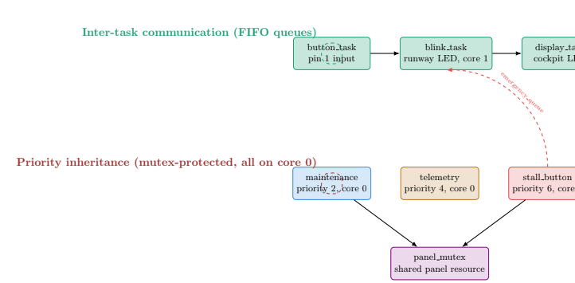

# Portfolio-RToS

## Avionics RTOS — FreeRTOS Task Architecture

Runway-lighting and stall-warning avionics system demonstrating FreeRTOS inter-task communication (FIFO queues) and priority-inversion protection (mutex-based priority inheritance) on the ESP32-S3.

## Links
- 🔧 Wokwi simulation: [Live simulation](https://wokwi.com/projects/465314244970953729)
- 📄 Project overview: [View PDF](https://drive.google.com/file/d/1-fqB-Qf8PrhsIJRd9cb0C6Lb8XBPZnjU/view?usp=drive_link)
- 📊 System architecture & WCET/RMS analysis: [View PDF](https://drive.google.com/file/d/1OWqDwNGP3NAPvVPpOWnhUALOgdC3y3dq/view?usp=drive_link)

## Demo Video

## System Architecture

Two task clusters: an ITC cluster (FIFO queues) and a priority-inheritance cluster (mutex), connected by a dedicated emergency-override path.

## Task Table + WCET Evidence

| Task | C (µs) | T | U = C/T | Priority | Core |
|---|---|---|---|---|---|
| button_task | 1650 | 50 ms | 0.0330 | 5 | unpinned |
| blink_task | 4399 | 1000 ms | 0.0044 | 5 | 1 |
| display_task | 16168 | 1000 ms | 0.0162 | 5 | unpinned |
| maintenance_task | 2,913,597 | 7030 ms | 0.4145 | 2 (low) | 0 |
| telemetry_task | 68585 | 500 ms | 0.1372 | 4 (med) | 0 |
| stall_button_task | 6828 | 50 ms | 0.1366 | 6 (high) | 0 |

Liu–Layland bound (n=6): 73.48%. Measured utilization: 74.19% (nominal), 78.31% (emergency mode).

## Hazard Analysis & Standard Mapping

| Hazard | Cause | Effect | Mitigation | Standard |
|---|---|---|---|---|
| Priority inversion delays stall warning | Low-priority task holds shared resource; medium-priority task preempts it | Emergency alert reaches pilot later than guaranteed | Mutex-based priority inheritance | DO-178C §6, ARP4761 |
| Unbounded CPU utilization | Busy-loop task with no fixed period | Missed deadlines system-wide | RMS analysis + fixed periods via vTaskDelayUntil | DO-178C timing verification |
| Cross-core scheduling nondeterminism | Tasks unpinned on dual-core target | Priority ordering doesn't govern actual contention | Explicit core pinning for contending tasks | ARP4754A system integration |
| Stack overflow under added logic | Under-provisioned task stack size | Task/system crash | Increased stack allocation, verified via testing | DO-178C structural coverage |
| Input bounce on emergency trigger | Mechanical switch contact bounce | Duplicate emergency events | Debounce logic (partial; noted as future work) | DO-178C robustness testing |
